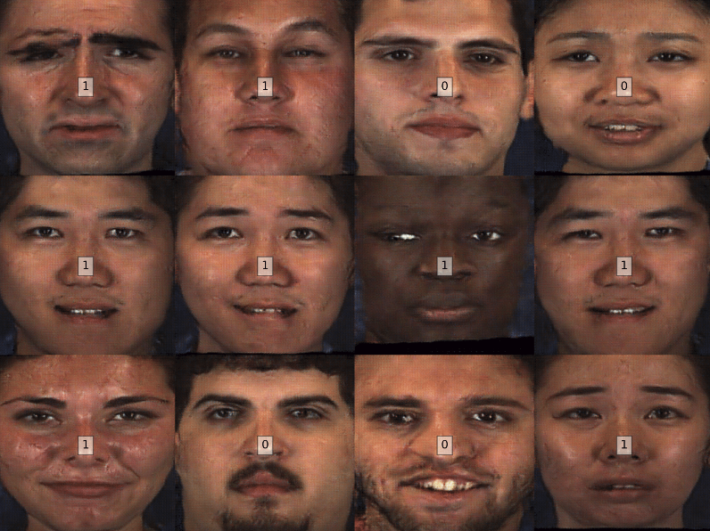

# Python tutorial
This is a basic tutorial on Python. We aim to cover general topics such as syntax and data structures, packaging, debugging, data loading and visualization.

## Warming up
- [ipython](https://ipython.org/)
- [Jupyter](http://jupyter.org/)

## Additional Info about LaTeX
- [Sharelatex](https://www.sharelatex.com)
- [Overleaf](https://www.overleaf.com/)

### FYI - Requierements and dependencies installation (Virtual machines are ready)
It is recommended to use Python [Anaconda](https://www.continuum.io/downloads) and its powerful package manager, [conda](https://github.com/conda/conda) to install additional packages.

--------------
# Homework
Please select one dataset of your preference. If you do not have one, you might use [BDSD](https://www2.eecs.berkeley.edu/Research/Projects/CS/vision/grouping/resources.htm). Your dataset _MUST_ have labels. 

Write a **python** script that does the following things:
1. Download (and untar if the case) your dataset. 
2. Choose _randomly_ an specific number (Let's say **N**. I'll explain it later) of those images. And, save them on a new and independent folder. 
3. Plot those images as a single plot i.e., N images in one figure. 
4. Using a different figure, plot your original images along the corresponding labels. 

Let's explore the last item. For instance, if you choose a classification problem, you might do it by showing the original images and somewhat saying the label of each one. Ej:

Where the label is depicted at the center of each image.

On the other hand, if you choose a detection/segmentation problem, you might do it by showing the original images along the corresponding groundtruths. Ej:

Your script **must** be an excecutable script that does all the aforementioned items just by typing:
`./run.py`

